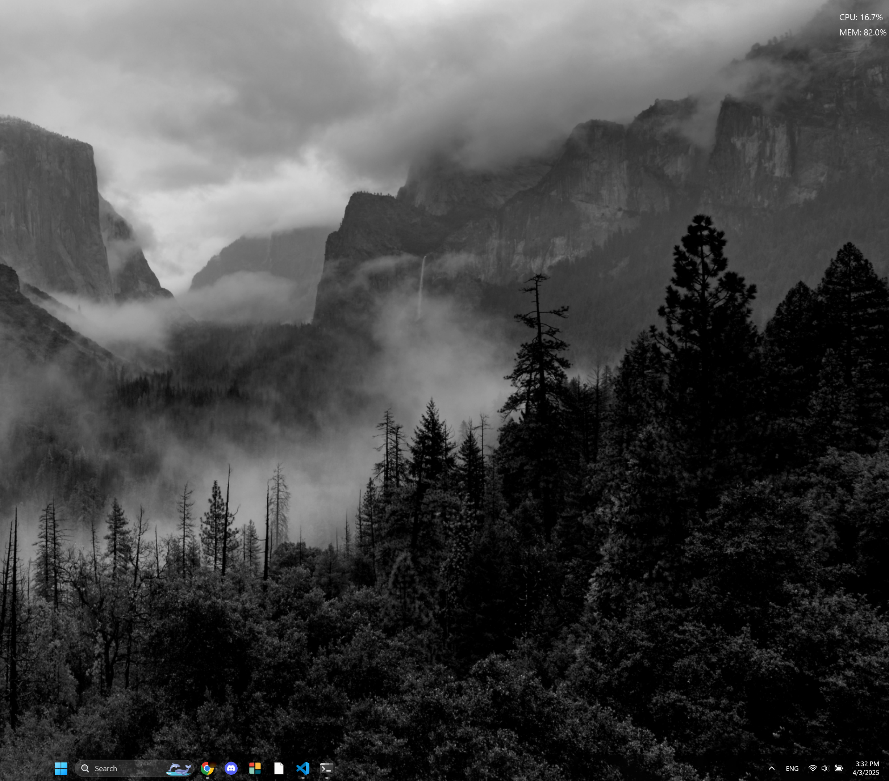

# Lightweight System Monitor Widget

A simple, lightweight, frameless, and transparent desktop widget for Windows (and potentially other platforms...haven't tested tbh) that displays live CPU and Memory usage. Sits unobtrusively in the corner of your desktop.

---
<div>
 
</div>

## Features

- Displays current **CPU and Memory** utilization percentage.
- **Frameless window** (no title bar or borders).
- **Transparent background.**
- Configurable update interval and text color.
- Configurable initial position (top-right or top-left corner).
- Draggable: **Click and drag** to reposition.
- Easy **closing via a right-click**.
- Attempts to stay off the taskbar.

## Requirements

- Python 3.X+
- Required libraries:
  - `PyQt6`
  - `psutil`

## Installation

1.  **Install Python:** Ensure you have Python 3 installed and added to your system's PATH.
2.  **Clone/Download:** Download the `.zip` or clone this repo.
3.  **Install Dependencies:** Open a terminal or command prompt in the project directory and run:

   ```bash
   pip install -r requirements.txt
   ```

## Running the Widget

  - Run the `.exe` application file. It will be in root folder or in the `dist` folder.
  - Run manually from the root folder with:
      - `python src\system_widget.py`

## Usage

 - **Configuration/Settings:** You can change the widget's behavior and text color by right-clicking on it and clicking "settings."
 - **Closing:** Right-click anywhere on the widget to open a context menu, then select "Close Widget."

## Notes

- **Platform Behavior:** While using cross-platform libraries, the visual appearance and behavior of frameless, transparent windows can sometimes vary between operating systems (Windows, macOS, Linux).
- **Click-Through:** Clicks on the transparent background area of the widget will _not_ pass through to the desktop or windows underneath it. (Planning on fixing this.)

---


<div align="center">
  <a href="https://seperet.com">
    
  </a>
</div>

